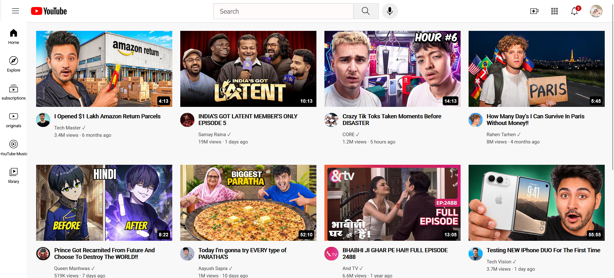

# YouTube Clone — HTML & CSS 🎥

A beginner-friendly YouTube clone built using **HTML and CSS** as part of my web development learning journey.

This project was created while following the **SuperSimpleDev HTML & CSS course** and is based on an older version of the YouTube interface.

## 📌 About the Project

The goal of this project was to practice building a more complex webpage layout from scratch while improving my understanding of HTML and CSS.

It helped me understand how different sections of a webpage can be structured and styled to create a complete website interface.

## 🛠️ Technologies Used

* HTML5
* CSS3

## ✨ What I Practiced

* HTML page structure
* CSS Grid
* Flexbox
* CSS positioning
* Image and thumbnail layouts
* Navigation and sidebar layouts
* Organizing multiple webpage sections
* Recreating an existing website interface

## 📸 Preview

### YouTube Clone

<<<<<<< HEAD

=======

>>>>>>> 894ecfdc08a5bfd991ecc79f9e9cb99d60c9ed7f

> **Note:** The interface is based on an older version of YouTube and was created for learning and practice purposes.

## 🎓 Learning Source

This project was built while learning from **SuperSimpleDev's HTML & CSS course**.

The project helped me strengthen my fundamentals and gave me practical experience with layouts, styling, and webpage structure.

## 🚀 What's Next?

I'm continuing to learn web development and plan to:

* Learn JavaScript more deeply
* Add interactivity to future projects
* Build projects based on my own ideas
* Eventually move toward React and full-stack development

## 👨‍💻 About Me

I'm a B.Tech Computer Science student currently learning web development and building projects to strengthen my programming fundamentals.

---

⭐ More projects coming as I continue learning!
<<<<<<< HEAD
=======

>>>>>>> 894ecfdc08a5bfd991ecc79f9e9cb99d60c9ed7f
